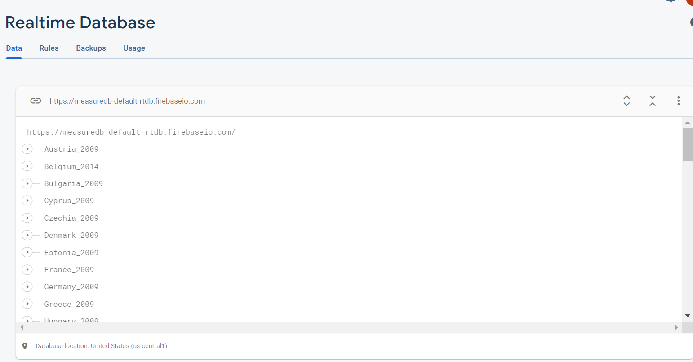
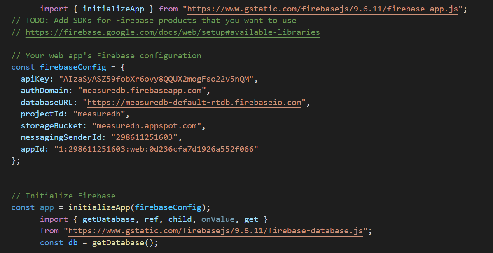
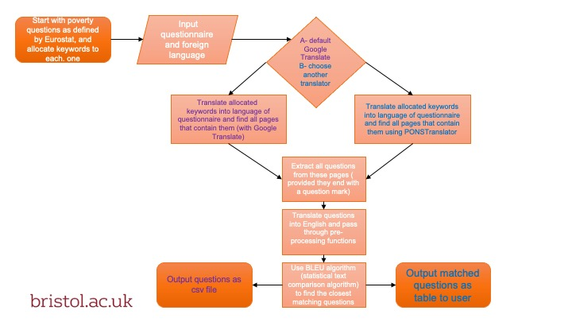
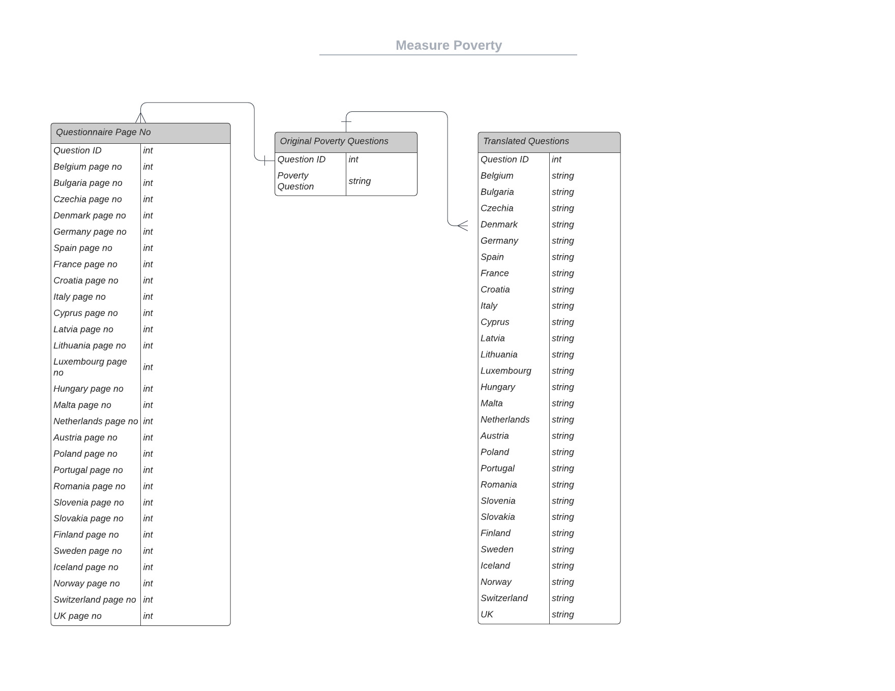

# MeasurePoverty 2021/2022


## Overview
Organizaton:University of Bristol working with UNICEF

Client: Dr David Gordon


### Context 

The Bristol Poverty Institue(University of Bristol) is working with UNICEF to develop a short question module to help improve the measurement of child and adult poverty in countries. 
The measure poverty project aims to match questions MAKE BETTER

Scrape the relevant data from the questionnaires of each country in EUROSTAT and automate the identification of the conceptually translated question text in each language. Upon completion, construct and populate a multilingual database, and upload results on the web.


### User Stories 


|  User | Story |   
|------ |-------|
|   Researcher    | As a researcher,  I want access to the questions from foreign questionnaires, but translated into English    |  
|   Member of UNICEF |  As a member of UNICEF,  I want access to the questions from foreign questionnaires, but translated into English to be able to check which countries ask all the required questions |   
| University student | I want to be able to use the poverty questions asked to aid my studies    |
|Dr David Gordon| As a member of UNICEF and a researcher, I would like to automate the identification of conceptual translated questions in each language. |


## User Guide/Deployment 


To access the website to view the poverty questions, use the following link:

http://2021-measure-poverty.vercel.app/

The user is able to choose a country, and see the matched questions for the 2009 questionnaires, as well as the 2014 questionnaires if it was not run in 2009.

Currently, we have only populated 2009 or 2014. To obtain the list of questions for different year, you would have to run on Anaconda terminal yourself. For countries with multiple questionnaires per year, please merge them before running it through the terminal.


## Populated Countries

Countries without 2009/2014: Croatia, Romania, Finland, Norway

Countries with 2009: Bulgaria, Czechia, Denmark, Germany, Estonia, Greece, Spain, France, Italy, Cyprus, Latvia, Lithuania, Luxembourg, Hungary, Malta, Netherlands, Austria, Poland, Portugal, Slovenia, Slovakia, Sweden, Iceland, Switzerland, United Kingdom

Countries with 2014: Belgium, Ireland, 

## Developer/Contribution Guide 


### Pre-requisites
We highly recommend running this program through Anaconda. You can download the distributions of Anaconda through the link below. Please ensure that Anaconda has a version of 1.7+
https://www.anaconda.com/products/distribution

Internet connections is required to run the code, as the Deep-translator API requires a connection to connect to the different translators used throughout the code.

#### Requirements
It is essential to have python 3.7+  and pip installed on your device. 
To run the source code, run the following to install the necessary libraries:


```
pip install --user -U nltk
pip install --user -U numpy
pip install pdfplumber 
pip install deep-translator
pip install regex 
pip install cdifflib
```

Throughout our code, we make use of nltk datasets. To install, open python3 on commandline and run the following:

```
>>>import nltk
>>>nltk.download("punkt")
>>>nltk.download("words")
```


## Database

The results from our backend matching functions are stored in the following NoSql database:



For developers wanting to upload more results to the database, the code is commented out at the bottom of question_extraction.py, as the results have been uploaded for 2009 and 2014.
In order to change the connection of the database for any country, simply change the connection code on the JavaScript code on the country. 



## Architecture & Workflow 

Our Approach:
1. Extract text from the questionnaire, translate into English, and identify questions based on whether they end with a quesiton mark
2. Narrow down the questions that contain the keywords that are included in the set list of poverty questions 
3. Use NLP and BLEU analysis to determinte the questions are poverty themed, and populate database
4. Upload and make the database available on the web, as well as open sourced for furture developments in the NLP algorithm 


### Architecture
#### Back-end structure (main function calls)


##### question_extraction.py: 
     find_and_preprocess_questions
     translate_keywords -- translate key words to foregin language
     tokenize_and_translate_questions
     filter_non_words
     find_and_preprocess_questions
##### main.py:
      blew_implementation
      group_questions_by_keyword
      main
##### translators.py:
      translator_into_english
      translator_into_foreign
##### keyword_identifiers.py
      a dictionary of target questions as keys, keywords as values
##### text_preprocessing.py:
      def remove_whitespace(text)
      remove_brackets(input_dictionary)
      check_keywords(input_dictionary)
      
### Backend Flowchart


#### Database structure



## References / Resources
Most reference contained in source code.

BLEU theory/information:
https://aclanthology.org/P02-1040.pdf

text pre-processing:
https://www.analyticsvidhya.com/blog/2021/09/essential-text-pre-processing-techniques-for-nlp/


NLP keywords extraction:
https://www.analyticsvidhya.com/blog/2022/03/keyword-extraction-methods-from-documents-in-nlp/


NLP topic modelling: 
https://www.analyticsvidhya.com/blog/2021/05/topic-modelling-in-natural-language-processing/


## License 
MIT License
